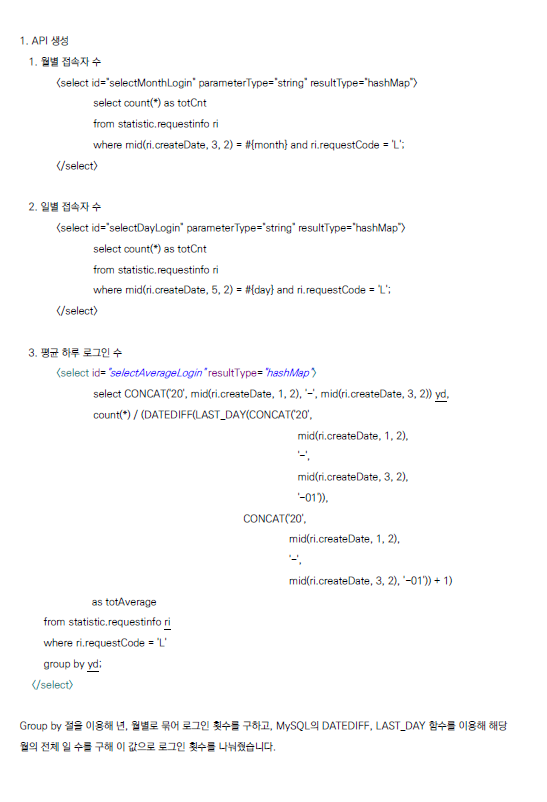
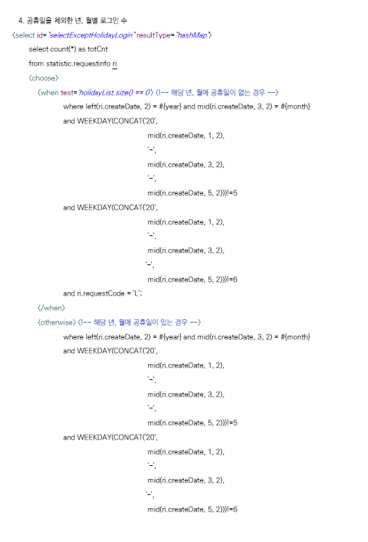
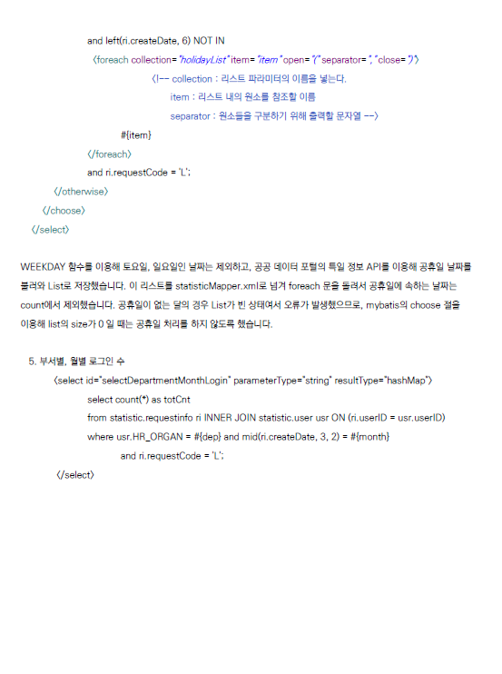
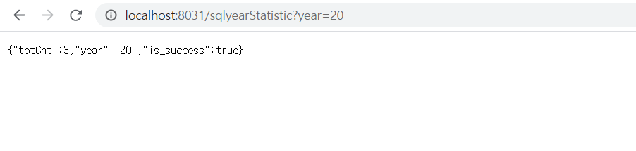
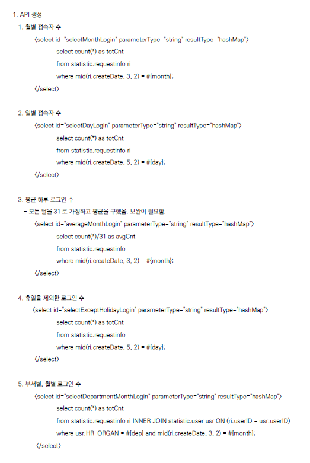
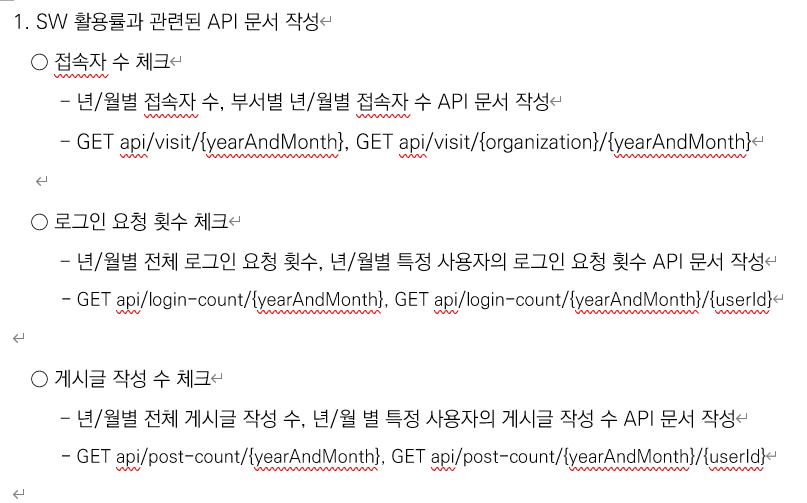
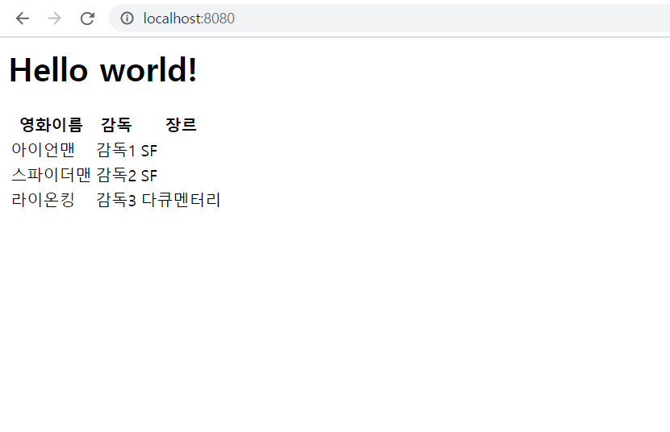
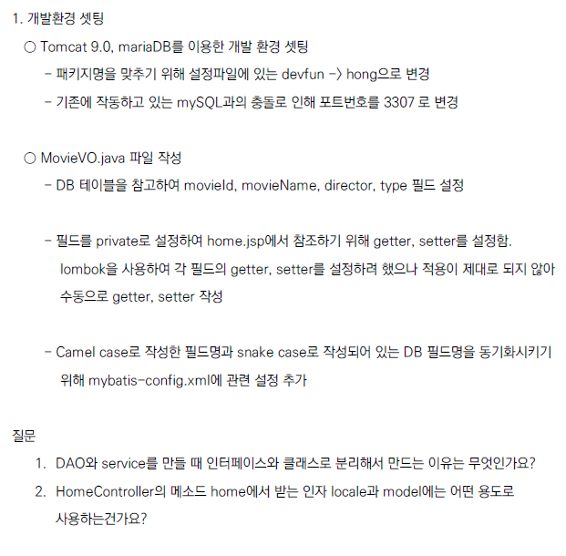

# Comento-spring-project
코멘토 직무부트캠프를 수강하며 작성한 코드를 모아놓았습니다.
4주차
----------
5가지 기능에 대한 API를 만들었습니다.
 * 월별 접속자 수
 * 일자별 접속자 수
 * 평균 하루 로그인 수
 * 휴일을 제외한 로그인 수
 * 부서별, 월별 로그인 수

사용한 DB 데이터는 아래와 같습니다.  
 
   #### user 테이블  
  </img> 
  
   #### requestinfo 테이블  
  </img> 

 

### 월별 접속자 수 API
  </img>  
  
   
  
### 일자별 접속자 수 API
  </img>  
  
   
  
### 평균 하루 로그인 수 API
  </img>    
  Group by절을 이용해 년도, 월 별로 묶었으며, 로그인 수를 세어 해당 월의 전체 일수로 나눠줬습니다.  
  전체 일수를 구하기 위해 MySQL의 DATEDIFF, LAST_DAY 함수를 사용했습니다.
  
  
   
  
 

### 휴일을 제외한 로그인 수 API
  </img> 
  
   
  
  토요일, 일요일 판정을 위해 MySQL의 WEEKDAY 함수를 이용했습니다. 공휴일 판정에는 공공 데이터 포털에서 제공하는 특일 정보 API를 사용했습니다.  
  해당 API의 응답을 Java의 JSONObject와 JSONArray를 사용하여 파싱했습니다.
  
   </img>  
   
   </img>  
    
   
  
### 부서별, 월별 접속자 수 API
  </img>  

### 주간 보고  

</img> 
</img> 
</img> 

3주차
----------
### 20년도 로그인 수 API
  20년도 로그인 수를 구하는 API를 만들었습니다.
  
  </img> 
  
### 5가지 쿼리에 대한 SQL문 작성
* 월별 접속자 수 조회
    
* 일일 접속자 수 조회
    
* 평균 하루 로그인 수
    
* 휴일을 제외한 로그인 수
    
* 부서별, 월별 로그인 수

### [파일](https://github.com/sunga201/Comento-spring-project/blob/3%EC%A3%BC%EC%B0%A8/%EB%AC%B8%EC%84%9C/3%EC%A3%BC%EC%B0%A8%20-%20SQL%20%EC%9E%91%EC%84%B1/sql.md)

### 주간 보고  

</img> 

2주차
----------
### API 문서 작성
SW 활용률과 관련된 API 문서를 작성했습니다. 

### [파일](https://github.com/sunga201/Comento-spring-project/tree/2%EC%A3%BC%EC%B0%A8/%EB%AC%B8%EC%84%9C/2%EC%A3%BC%EC%B0%A8-API%20%EB%AC%B8%EC%84%9C%20%EC%9E%91%EC%84%B1)

 

### 주간 보고  

</img> 

 

1주차
----------
### 실행 결과
</img> 

 

### 주간 보고
</img> 

### [파일](https://github.com/sunga201/Comento-spring-project/blob/2%EC%A3%BC%EC%B0%A8/%EB%AC%B8%EC%84%9C/weekly_report/1%EC%A3%BC%EC%B0%A8/%EC%A3%BC%EA%B0%84%EB%B3%B4%EA%B3%A0.pdf)
